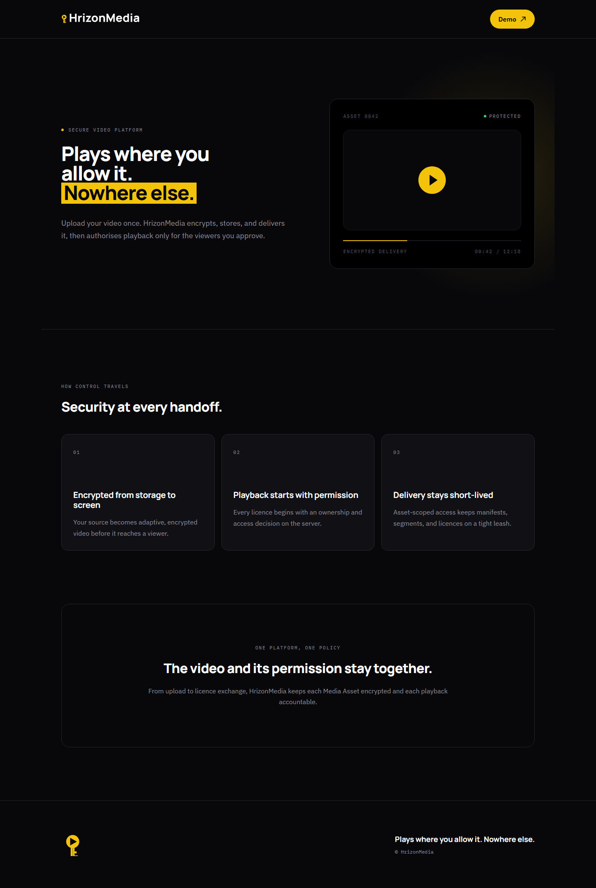
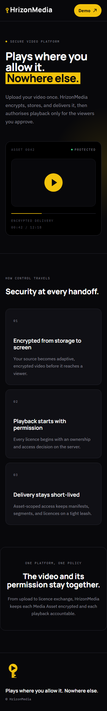

# Issue #41 staging verification

Staging URL: https://hrizonmedia-staging-web-staging.up.railway.app

The existing `hrizonmedia` Railway project now has an isolated `staging` environment,
`hrizonmedia-staging-web` service, `Postgres-RGHC` database with its own volume, and
private `hrizonmedia-staging-cms` bucket. Independent Payload, callback and cron
secrets were generated and retained only on Railway. Production's Demo flag was
read and confirmed disabled; production variables and data were not modified.

Verification date: 2026-09-15.

Implementation revision: `0c713fb` (fresh branch from `e8ac2a1`).

| Check | Result |
| --- | --- |
| Optimized Next.js build | Passed |
| TypeScript | Passed |
| Repository lint | Passed, 23 existing warnings |
| Route/Payload integration suite | 86 passed |
| Final local browser suite | 27 passed, 1 expected skip (Demo-disabled case in enabled environment) |
| Deployed browser suite | 27 passed, 1 expected skip; Chromium, Chrome and Edge (21.5 minutes) |
| Deployed desktop/mobile visual regression | Passed |
| Deployed palette, typography, contrast and keyboard focus | Passed |
| `/health` | Uncached 200 with `{"status":"ok"}` after database initialization and migrations |
| Production Demo flag | Disabled |
| Railway maintenance diagnostics | `media_cycle_completed` observed |

The deployed browser suite uses the existing approved tests against the staging
HTTPS origin and matching staging database/authentication configuration. A temporary
localhost-only SSH tunnel reaches private PostgreSQL; no public database proxy was
created. Its fixture process has automatic scheduling/execution disabled, leaving
the Railway worker exclusively responsible for provider work. Fixtures are
disposable and cleaned after each case.

The validation tunnel was closed and its temporary SSH key revoked after the suite.

Both Standards and Spec reviews identified the competing fixture worker; the fix
has a regression check at the existing Payload configuration seam. The initial local
browser run also exposed cold Demo compilation exceeding a 15-second navigation
assertion; the existing case passes with the established 60-second sign-in timeout.

Stalled-job recovery and failed cleanup are exercised by integration tests, which
emit credential-safe `processing_stalled`, `media_cleanup_pending` and
`lifecycle_audit_pending` diagnostics. In Railway, these events and
`source_cleanup_pending`, `media_cycle_failed` and `health_unavailable` can be
filtered and correlated with numeric record IDs and operator Audit Events.

This deployment demonstrates deterministic control-plane and playback-contract
behavior. It does not certify real DRM, actual encrypted provider playback or
production performance. Fake upload bytes are process-local and lost on restart;
real providers remain a separate selection and verification checkpoint.

Deployed brand evidence:

